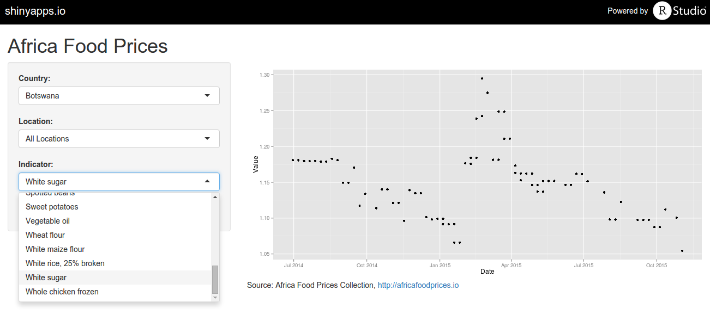

Food Prices in Africa
========================================================
author: Dennis van den Berg
date: November 18 2015
transition: concave


Visualizing Open Data
========================================================



Check web-app at: https://dljvandenberg.shinyapps.io/africafoodprices


Functionalities
========================================================

Historical prices of commodities in African countries

* 55 commodities (mostly food): beef with bones, bream fish, cooking salt, ..
* 25 countries: Algeria, Angola, Benin, ..
* Currency: USD or local

Based on Open Data provided by: http://africafoodprices.io


Behind the Screen
========================================================

TODO: Modify R Code


```r
summary(cars)
```
***

```
     speed           dist       
 Min.   : 4.0   Min.   :  2.00  
 1st Qu.:12.0   1st Qu.: 26.00  
 Median :15.0   Median : 36.00  
 Mean   :15.4   Mean   : 42.98  
 3rd Qu.:19.0   3rd Qu.: 56.00  
 Max.   :25.0   Max.   :120.00  
```

It's open and free, so use it!
========================================================

Questions, comments or contributions?
* Contact me at dljvandenberg@gmail.com
* Check my GitHub page: http://dljvandenberg.github.io
* Or fork my repo: https://github.com/dljvandenberg/coursera_data_products

Acknowledgements
* Thanks to http://africafoodprices.io for providing Open Data
