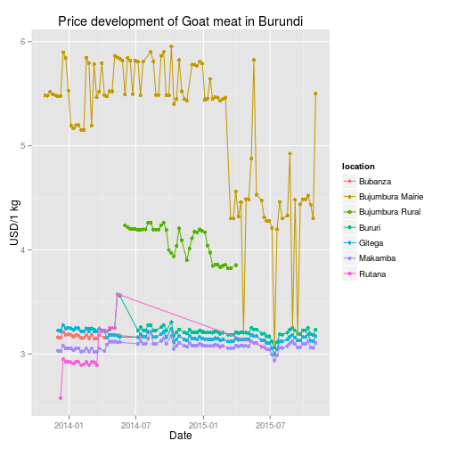
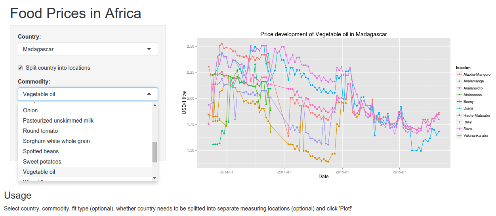

Food Prices in Africa
========================================================
author: Dennis van den Berg
date: November 22 2015
transition: concave


From Open Data to Visualization
========================================================


```
  country      location           indicator measure      Unit       Date
1 Algeria All Locations Loaf of white bread     USD USD/450 g 2014-08-25
2 Algeria All Locations Loaf of white bread     USD USD/450 g 2014-08-25
      Value
1 0.1141835
2 0.1141835
```
***
 

Data: [African Development Bank](http://opendataforafrica.org)


To Interactive Web Application
========================================================



Check web-app at: https://dljvandenberg.shinyapps.io/africafoodprices


Functionalities
========================================================

Historical prices of commodities in African countries

* 55 commodities (mostly food): beef with bones, bream fish, cooking salt, ..
* 25 countries: Algeria, Angola, Benin, ..
* Multiple measuring locations per country
* Historical trendlines per location, including confidence intervals
* Currency: USD


It's open and free, so use it!
========================================================

Questions, comments or contributions?
* Contact me at dljvandenberg@gmail.com
* Check my GitHub page: http://dljvandenberg.github.io
* Or fork my repo: https://github.com/dljvandenberg/coursera_data_products

Acknowledgements
* Thanks to The African Development Bank (http://opendataforafrica.org) for providing open data
